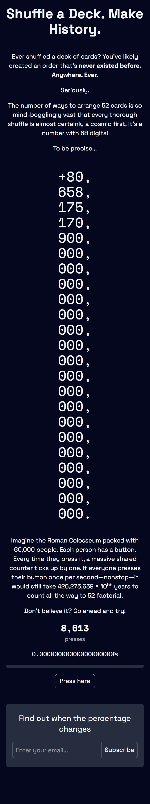

# 52!



A collaborative counter demonstrating the mind-boggling scale of 52 factorial (52!). The project educates visitors about the astronomical number of ways to arrange a deck of 52 cards—each shuffle creates an order that has almost certainly never existed before in the history of the universe.

Users can click a shared counter that ticks toward 52!, with the count updating live for all visitors simultaneously. The site illustrates just how impossible it would be to reach this number: even with 60,000 people clicking once per second nonstop, it would take 426,275,659 × 10⁵⁵ years to count to 52 factorial.

One of the key engineering challenges was designing the system to handle the load of many users clicking as rapidly as possible while maintaining synchronization across all connected clients.

🌐 [fiftytwofactorial.com](https://fiftytwofactorial.com)

## Quick Start

```bash
bun install
bun run dev
```

Open [http://localhost:3000](http://localhost:3000)

## Stack

- **TanStack Start** - Full-stack React framework
- **TinyBase** - Real-time state management
- **SQLite + Drizzle** - Database & ORM
- **Tailwind CSS** - Styling
- **Netlify** - Deployment

## Scripts

- `bun run dev` - Development server
- `bun run build` - Build for production
- `bun run start` - Production server
- `bun run format` - Format code
- `bun run lint` - Lint code
